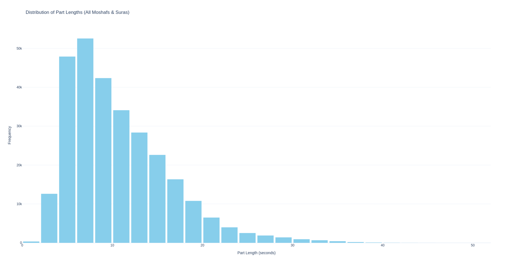

# Modeling  

Our Quran Phonetic script has two outputs: `phonemes` and `sifat` (which has 10 attributes). We modeled this as follows: Imagine you are given an input speech utterance and want to output transcripts in Arabic, English, French, and German simultaneously. We implemented this as a speech encoder with a linear layer for each language. Replacing languages with our 11 levels (`phonemes` and the 10 sifat), we obtain 11 parallel transcription levels. We chose CTC loss [graves2006ctc] without language model integration because we aim to capture what the user actually said, not what they intended to say. We name our architecture **Multi-level CTC**.  

We compute the loss by averaging all CTC losses for the 11 levels, assigning a weight of 0.4 to the `phonemes` level as it has the largest vocabulary size (43) compared to other levels.  

  

We fine-tuned Facebook's Wav2Vec2-Bert [barrault2023seamless] for a single epoch with a constant learning rate of `5e-5`. We applied augmentations identical to Silero VAD [Silero VAD] using the `audiomentations` library [Audiomentations], with additional augmentations: `TimeStretch` and `GainTransition`. We filtered out samples longer than `30 seconds` not due to model limitations, but for efficient GPU utilization - sacrificing only 3k samples out of 250k training samples.  

  

The training was done using an H200 GPU with 141 GB of GPU memory for 7 hours.
