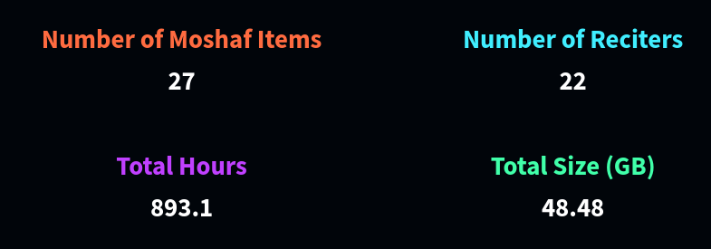
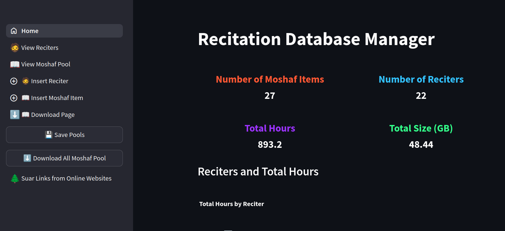
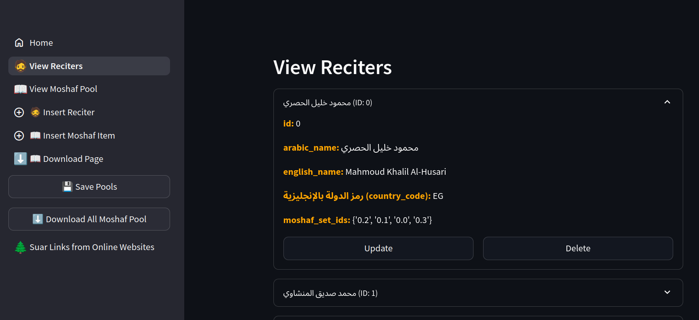
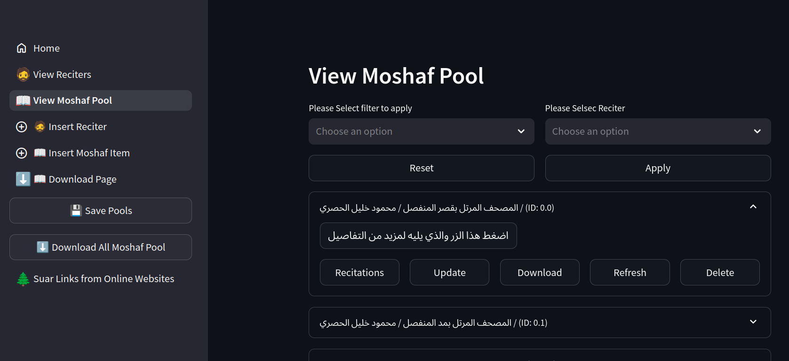
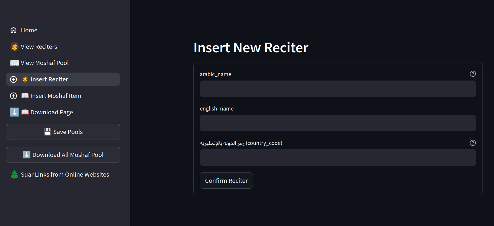
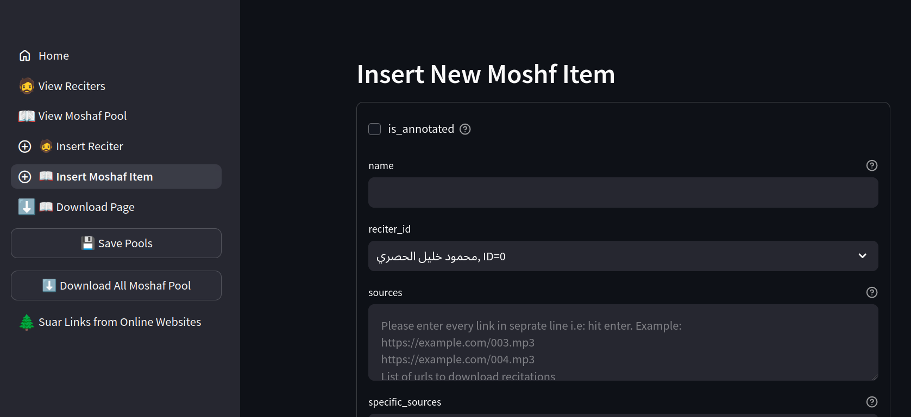
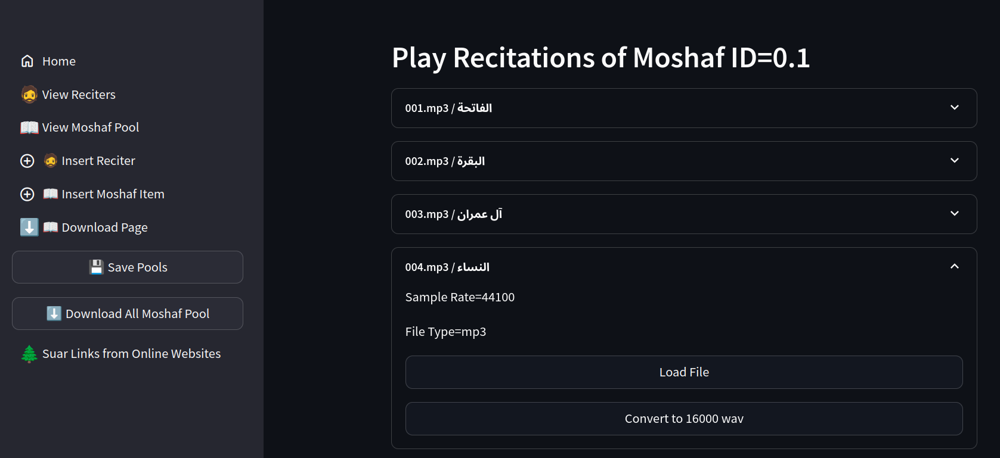

## Collection of Expert Recitations

Recitations were collected from 22 world-class reciters, amounting to a total of **893 hours** of audio before filtering. The collection process prioritized premium audio quality.


*Figure 1: Overview statistics of the collected audio database.*


*Figure 2: Total duration of collected recitations, broken down by individual reciter.*

To facilitate this collection, a web GUI was developed using [Streamlit](https://streamlit.io/). This application performs the following tasks:
*   Downloads audio tracks and extracts their metadata.
*   Organizes the data by Moshaf, with each chapter saved as a separate file (e.g., `001.mp3`).
*   Provides an interface for annotating Moshaf attribute cards.

### Running the Collection Application

#### Cloning the Repository
The application source code can be obtained by cloning the Git repository:
```bash
git clone https://github.com/obadx/prepare-quran-dataset
```

#### Installing `uv`
The project uses `uv` for dependency management. It can be installed via `pip`:
```bash
pip install uv
```
Alternatively, it can be installed directly from the official installer:
```bash
curl -LsSf https://astral.sh/uv/install.sh | sh
```

#### Installing Project Dependencies
Navigate to the project directory and sync the dependencies, including those for annotation:
```bash
cd prepare-quran-dataset
uv sync --extra annotate
```

#### Installing Frontend Dependencies
The frontend has additional requirements. Navigate to its directory and install them:
```bash
cd frontend
uv pip install -r requirements.txt
```

#### Launching the Frontend Application
With dependencies installed, the Streamlit application can be launched from the `frontend` directory:
```bash
streamlit run streamlit_app.py
```

### UI Snapshots


*Figure 3: The main page of the custom annotation platform.*


*Figure 4: The reciter management view within the application.*


*Figure 5: View displaying all available Masahif in the database.*


*Figure 6: Dialog for inserting a new reciter's details.*


*Figure 7: Dialog for creating and annotating a new Moshaf attribute card.*


*Figure 8: Interface for viewing a Moshaf's tracks and playing individual recitations.*
