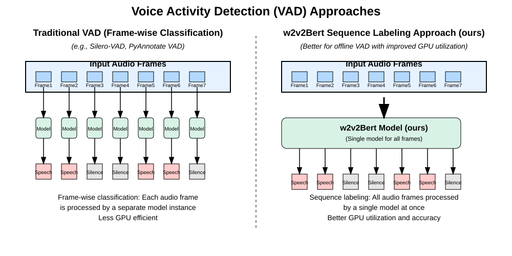

## Segment Recitations  

Since Tajweed rules are affected by pauses (وقف), accurate segmentation is crucial. We initially tested open-source Voice Activity Detection (VAD) models including SileroVAD [Silero VAD] and PyAnnotate [Plaquet23]. Poor Quran-specific performance led us to develop a custom segmenter by fine-tuning Wav2Vec2-BERT [barrault2023seamless] for frame-level classification.  

### Preparing Segmenter Data  
We selected mosahf compatible with SileroVAD v4, using [EveryAyah](https://everyayah.com/) (pre-segmented by ayah) as ground truth. After tuning parameters per Moshaf:  
- Threshold  
- Minimum silence duration (merges segments)  
- Minimum speech duration (discards short segments)  
- Padding (added at segment boundaries)  

| Reciter Name (Arabic)     | ID | URL                                                                                             | Window Size (Samples) | Threshold | Min Silence (ms) | Min Speech (ms) | Pad (ms) |
|---------------------------|----|-------------------------------------------------------------------------------------------------|-----------------------|-----------|------------------|-----------------|----------|
| محمود خليل الحصري         | 0  | [Download](https://everyayah.com/data/Husary_128kbps/000_versebyverse.zip)                     | 1536                  | 0.3       | 500              | 1000            | 40       |
| محمد صديق المنشاوي        | 1  | [Download](https://everyayah.com/data/Minshawy_Murattal_128kbps/000_versebyverse.zip)          | 1536                  | 0.3       | 400              | 1000            | 20       |
| عبد الباسط عبد الصمد      | 2  | [Download](https://everyayah.com/data/Abdul_Basit_Murattal_192kbps/000_versebyverse.zip)       | 1536                  | 0.3       | 400              | 700             | 20       |
| محمود علي البنا           | 3  | [Download](https://everyayah.com/data/mahmoud_ali_al_banna_32kbps/000_versebyverse.zip)        | 1536                  | 0.3       | 400              | 700             | 20       |
| على الحذيفي               | 5  | [Download](https://everyayah.com/data/Hudhaify_128kbps/000_versebyverse.zip)                   | 1536                  | 0.3       | 350              | 700             | 5        |
| أيمن رشدي سويد            | 6  | [Download](https://everyayah.com/data/Ayman_Sowaid_64kbps/000_versebyverse.zip)                | 1536                  | 0.3       | 500              | 1000            | 10       |
| محمد أيوب                 | 7  | [Download](https://everyayah.com/data/Muhammad_Ayyoub_128kbps/000_versebyverse.zip)            | 1536                  | 0.3       | 400              | 1000            | 10       |
| إبراهيم الأخضر            | 8  | [Download](https://everyayah.com/data/Ibrahim_Akhdar_32kbps/000_versebyverse.zip)              | 1536                  | 0.3       | 390              | 700             | 30       |
[table_segmenter_data]
The table showes The dataset of our segmenter totaling 8 complete moshaf

#### Data Augmentation  
Using the [Audiomentations] library, we replicated SileroVAD's noise setup on 40% of samples, adding:  
* `TimeStretch` (0.8x-1.5x) to simulate recitation speeds  
* Sliding window truncation (1-second windows) for long samples instead of exclusion  

### Training Segmenter  
We fine-tuned Wav2Vec2-BERT for frame classification (1 epoch):  

  

Results on unseen mosahf:  
| Metric          | Value    |
|-----------------|----------|
| Test Loss       | 0.0277   |
| Test Accuracy   | 0.9935   |
| Test F1 Score   | 0.99476  |
[table_vad_resuls]
The table showes the resutling for non-trained moshaf which showes suprior perfomrance. We do prove the quality of the segmenter by using it to segment our dataset which showes the same best pefromrnace excpet for very very fast reciation (حدر).


### Python API

After trainng we made our segmenter available to the community published as [recitations-segmenter](https://github.com/obadx/recitations-segmenter) so poopble can use it with ace


#### Library Installation

##### Installation Requirements

Install the following libraries:

* [ffmpeg](https://ffmpeg.org/download.html)
* [libsoundfile](https://github.com/libsndfile/libsndfile/releases)

###### Linux

```bash
sudo apt-get update
sudo apt-get install -y ffmpeg libsndfile1 portaudio19-dev
```

###### Windows & Mac

You can create an `anaconda` environment and then download these two libraries.

```bash
conda create -n segment python=3.12
conda activate segment
conda install -c conda-forge ffmpeg libsndfile
```

###### Using pip

```bash
pip install recitations-segmenter
```

###### Using uv

```bash
uv add recitations-segmenter
```

#### API Usage with Python

Below is a complete example of using the library with Python. There is also an example available on Google Colab:

[![Google Colab][colab-badge]][colab-url]

```python
from pathlib import Path

from recitations_segmenter import segment_recitations, read_audio, clean_speech_intervals
from transformers import AutoFeatureExtractor, AutoModelForAudioFrameClassification
import torch

if __name__ == '__main__':
    device = torch.device('cuda')
    dtype = torch.bfloat16

    processor = AutoFeatureExtractor.from_pretrained(
        "obadx/recitation-segmenter-v2")
    model = AutoModelForAudioFrameClassification.from_pretrained(
        "obadx/recitation-segmenter-v2",
    )

    model.to(device, dtype=dtype)

    # Change this to the file paths of Holy Quran recitations
    # File paths containing the Holy Quran Recitations
    file_pathes = [
        './assets/dussary_002282.mp3',
        './assets/hussary_053001.mp3',
    ]
    waves = [read_audio(p) for p in file_pathes]

    # Extracting speech intervals in samples according to 16000 Sample rate
    sampled_outputs = segment_recitations(
        waves,
        model,
        processor,
        device=device,
        dtype=dtype,
        batch_size=8,
    )

    for out, path in zip(sampled_outputs, file_pathes):
        # Clean The speech intervals by:
        # * merging small silence durations
        # * remove small speech durations
        # * add padding to each speech duration
        # Raises:
        # * NoSpeechIntervals: if the wav is complete silence
        # * TooHighMinSpeechDruation: if `min_speech_duration` is too high which
        # results in deleting all speech intervals
        clean_out = clean_speech_intervals(
            out.speech_intervals,
            out.is_complete,
            min_silence_duration_ms=30,
            min_speech_duration_ms=30,
            pad_duration_ms=30,
            return_seconds=True,
        )

        print(f'Speech Intervals of: {Path(path).name}: ')
        print(clean_out.clean_speech_intervals)
        print(f'Is Recitation Complete: {clean_out.is_complete}')
        print('-' * 40)
```

#### Command Line Interface

You can directly use the library without installing it via:

```bash
uvx recitations-segmenter alfateha.mp3
```

Or after installation using:

```bash
recitations-segmenter alfateha.mp3
```

The recitation timestamps will be extracted based on pauses (Waqf) in two formats:

##### In the terminal
```text
100%|██████████████████████████████████████████████████████████████████████████████████████████████████████████████████████████████████████████████████████| 1/1 [00:03<00:00,  3.04s/it]
Speech Intervals:
tensor([[ 0.7300,  5.2900],
        [ 6.5100, 10.9900],
        [12.4700, 17.2100],
        [18.1500, 21.6850],
        [22.6850, 26.2650],
        [27.4450, 33.2050],
        [34.2650, 38.6250],
        [39.8250, 53.3200]])

```
##### And as a JSON file in the path: `output/speech_intervals_alfateha.json`

The timestamps for each Quranic segment within Surah Al-Fatiha will be extracted into the path: `output` containing a file `speech_intervals_alfateha.json`. This file contains the following:

```json
{
    "clean_speech_intervals": [
        [
            0.7300000190734863,
            5.289999961853027
        ],
        [
            6.510000228881836,
            10.989999771118164
        ],
        [
            12.470000267028809,
            17.209999084472656
        ],
        [
            18.149999618530273,
            21.684999465942383
        ],
        [
            22.684999465942383,
            26.264999389648438
        ],
        [
            27.44499969482422,
            33.20500183105469
        ],
        [
            34.26499938964844,
            38.625
        ],
        [
            39.82500076293945,
            53.31999969482422
        ]
    ],
    "speech_intervals": [
        [
            0.7599999904632568,
            5.260000228881836
        ],
        [
            6.539999961853027,
            10.960000038146973
        ],
        [
            12.5,
            17.18000030517578
        ],
        [
            18.18000030517578,
            21.655000686645508
        ],
        [
            22.71500015258789,
            26.235000610351562
        ],
        [
            27.475000381469727,
            33.17499923706055
        ],
        [
            34.29499816894531,
            38.595001220703125
        ],
        [
            39.85499954223633,
            53.290000915527344
        ]
    ],
    "is_complete": true
}
```

Each JSON file includes these keys:

* `clean_speech_intervals`: Start and end timestamps in seconds for each segment after refinement.
* `speech_intervals`: Start and end timestamps in seconds for each segment (raw).
* `is_complete`: Whether the Quranic recitation is complete or if the last segment does not include a clear pause (Waqf).

##### Detailed Command Line Description

```text
usage: recitations-segmenter [-h] [-o OUTPUT] [--min-silence-duration-ms MIN_SILENCE_DURATION_MS] [--min-speech-duration-ms MIN_SPEECH_DURATION_MS] [--pad-duration-ms PAD_DURATION_MS]
                             [--return-samples] [--batch-size BATCH_SIZE] [--max-duration-ms MAX_DURATION_MS] [--device {cpu,cuda}] [--dtype {bfloat16,float16,float32}]
                             inputs [inputs ...]

Segment Holy Quran recitations into speech intervals based on pauses (Waqf) using a Wav2Vec2Bert model.

options:
  -h, --help            show this help message and exit

Input/Output Options:
  inputs                Input paths (files or directories) containing audio files
  -o OUTPUT, --output OUTPUT
                        Output directory for JSON results (default: ./output)

Segmentation Parameters:
  --min-silence-duration-ms MIN_SILENCE_DURATION_MS
                        Minimum silence duration (ms) between speech segments
                        - Silence shorter than this will be merged with speech
                        - Default: 30ms
  --min-speech-duration-ms MIN_SPEECH_DURATION_MS
                        Minimum valid speech duration (ms)
                        - Speech segments shorter than this will be removed
                        - Default: 30ms
  --pad-duration-ms PAD_DURATION_MS
                        Padding added around speech segments (ms)
                        Default: 30ms
  --return-samples      Return intervals in samples according to 16000 sampling rate.
                        - Default to return interval in seconds

Model Configuration:
  --batch-size BATCH_SIZE
                        Number of audio chunks processed simultaneously
                        - Higher values may increase speed but require more GPU memory.
                        - Default: 8 which occupies nearly 3GB of GPU memory.
  --max-duration-ms MAX_DURATION_MS
                        Maximum processing chunk duration (2-20000ms)
                        - Affects memory usage and processing granularity
                        - Do not Change it unless there is a strong reason.
                        - Default: 19995ms
  --device {cpu,cuda}   Processing device selection
                        Default: cuda
  --dtype {bfloat16,float16,float32}
                        Numerical precision for model computation:
                        - bfloat16: Best performance (modern GPUs)
                        - float16: Legacy support
                        - float32: Maximum precision (CPU fallback)
                        Default: bfloat16

Examples:
  # Process single file with default settings
  recitations-segmenter input.mp3 -o results

  # Process multiple files with default settings
  recitations-segmenter input1.mp3 input2.wav -o output

  # Process directory of audio files
  recitations-segmenter /path/to/recitations/ --output ./segmentation_results

  # Process: audio files and directory of audio files
  recitations-segmenter input.mp3 /path/to/recitations/ --output ./segmentation_results

  # Adjust segmentation parameters
  recitations-segmenter input.wav --min-silence-duration-ms 200 --min-speech-duration-ms 900 --pad-duration-ms 40

File Formats Supported:
  MP3, WAV, FLAC, OGG, AAC, M4A, OPUS

Output Format:
  Each input file generates a JSON file containing:
  - clean_speech_intervals: Final filtered speech segments
  - speech_intervals: Raw detected speech segments
  - is_complete: whether the recitation has a complete pause (Waqf) or the recitation is continuing (has not stopped yet)

Error Handling:
  - Skips unsupported file types
```

#### Library Documentation (API Reference)

##### `segment_recitations`

```python
@torch.no_grad()
def segment_recitations(
    waves: list[torch.FloatTensor],
    model: Wav2Vec2BertForAudioFrameClassification,
    processor: Wav2Vec2BertProcessor,
    batch_size=64,
    device=torch.device('cpu'),
    dtype=torch.bfloat16,
    return_probabilities=False,
    sample_rate=16000,
    processor_window=400,
    processor_hop=160,
    processor_stride=2,
    max_duration_ms=19995,
    speech_label=1,
    silence_label=0,
    cache_dir: Optional[str | Path] = None,
    overwrite_cache: Optional[bool] = False,
) -> list[W2vBSegmentationOutput]:
```

Segment The Holy Quran recitations into speech intervals based on pauses (Waqf) using a Wav2Vec2Bert model.

**Arguments**:
- `waves` (`list[torch.FloatTensor]`): List of audio waveforms to process (each as FloatTensor)
- `model` (`Wav2Vec2BertForAudioFrameClassification`): Loaded Wav2Vec2BertForAudioFrameClassification model
- `processor` (`Wav2Vec2BertProcessor`): Wav2Vec2BertProcessor for feature extraction
- `batch_size` (`int`): Number of samples per batch
- `sample_rate` (`int`): Input audio sampling rate (must be 16000)
- `processor_window` (`int`): Processor window size (fixed at 400 samples)
- `processor_hop` (`int`): Processor hop length (fixed at 160 samples)
- `processor_stride` (`int`): Processor stride (fixed at 2)
- `max_duration_ms` (`int`): Maximum chunk duration in ms for processing (2-20000)
- `speech_label` (`int`): Class index for speech segments
- `silence_label` (`int`): Class index for silence segments
- `device` (`torch.device`): Torch device for inference
- `dtype` (`torch.dtype`): Data type for model computation only. Default is `torch.bfloat16`; for post-processing we use `torch.float32`
- `return_probabilities` (`bool`): Whether to return class probabilities
- `cache_dir` (`Optional[str | Path]`): Optional feature disabled by default: if it is not `None`, saves speech intervals to the `cache_dir` so next time for inference with the same input `waves` we do not have to recompute the speech_intervals.
- `overwrite_cache` (`Optional[bool]`): if a `cache_dir` exists, overwrite it.

**Returns**:
- `list[W2vBSegmentationOutput]`:
-  Every `W2vBSegmentationOutput` is:
  - `clean_speech_intervals` (`torch.FloatTensor`):  `None`.
  - `speech_intervals` (`torch.FloatTensor`): Tensor of shape (N, 2) containing raw speech intervals before filtering. Format: `[[speech_start, speech_end], [speech_start, speech_end], ...]` in samples.
  - `probs` (`torch.FloatTensor | None`): Class probabilities (None if not requested)
  - `is_complete` (`bool`): Whether audio processing completed normally

**Note**:
- Processes audio in chunks of max_duration_ms for GPU memory efficiency
- Input waveforms are automatically padded and batched
- Final interval end is clamped to (audio_length + hop*stride) if not provided

---

##### `clean_speech_intervals`

```python
def clean_speech_intervals(
    speech_intervals: torch.LongTensor,
    is_complete: bool,
    min_silence_duration_ms=30,
    min_speech_duration_ms=30,
    pad_duration_ms=30,
    sample_rate=16000,
    return_probabilities=False,
    return_seconds=False,
) -> W2vBSegmentationOutput:
```

Performs cleaning on raw speech intervals extracted by the model. Cleans the speech intervals by:
* merging small silence durations.
* removing small speech durations.
* adding padding to each speech duration.

**Arguments**:
- `speech_intervals` (`torch.LongTensor`): Tensor of shape (N, 2) containing raw speech intervals before filtering. Format: `[[speech_start, speech_end], [speech_start, speech_end], ...]` in samples.
- `is_complete` (`bool`): Whether audio processing completed normally
- `min_silence_duration_ms` (`int`): Minimum silence duration (ms) between speech segments. Silence durations < `min_silence_duration_ms` will be merged into speech durations
- `min_speech_duration_ms` (`int`): Minimum duration (ms) for a valid speech segment. Speech intervals durations < `min_speech_duration_ms` will be removed
- `pad_duration_ms` (`int`): Padding duration (ms) to add around speech segments
- `sample_rate` (`int`): Audio sample rate in Hz
- `return_probabilities` (`bool`): Whether to return class probabilities
- `return_seconds` (`bool`): Whether to return intervals in seconds instead of samples

**Returns**:
- `W2vBSegmentationOutput`:
  - `clean_speech_intervals` (`torch.FloatTensor`): Tensor of shape (N, 2) containing speech intervals after filtering. Format: `[[speech_start, speech_end], ...]` in samples if `return_seconds` is `false`, otherwise returns the speech intervals in seconds.
  - `speech_intervals` (`torch.FloatTensor`): Tensor of shape (N, 2) containing raw speech intervals before filtering. Format: `[[speech_start, speech_end], ...]` in samples if `return_seconds` is `false`, otherwise returns the speech intervals in seconds.
  - `probs` (`torch.FloatTensor | None`): Class probabilities (None if not requested)
  - `is_complete` (`bool`): Whether audio processing completed normally

**Raises**:
- `NoSpeechIntervals`: If no speech segments are detected
- `TooHighMinSpeechDuration`: If filtering removes all speech segments

**Note**:
- Intervals are clamped to prevent negative starts or exceeding audio length
- Final interval end is clamped to (audio_length + hop*stride) if not provided

##### Data Structures

##### `W2vBSegmentationOutput`
Named tuple containing:
- `clean_speech_intervals`: `torch.Tensor` or `None`
- `speech_intervals`: `torch.Tensor`
- `probs`: `torch.Tensor` or `None`
- `is_complete`: `bool`

##### Exceptions
- `NoSpeechIntervals`: Raised when input contains no speech
- `TooHighMinSpeechDuration`: Raised when filtering removes all segments

