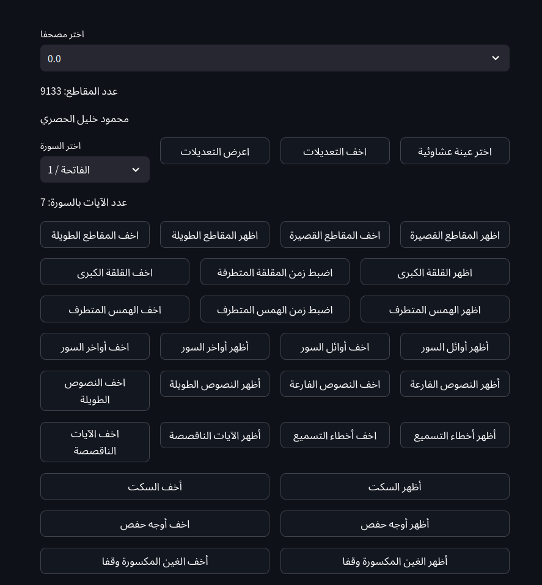
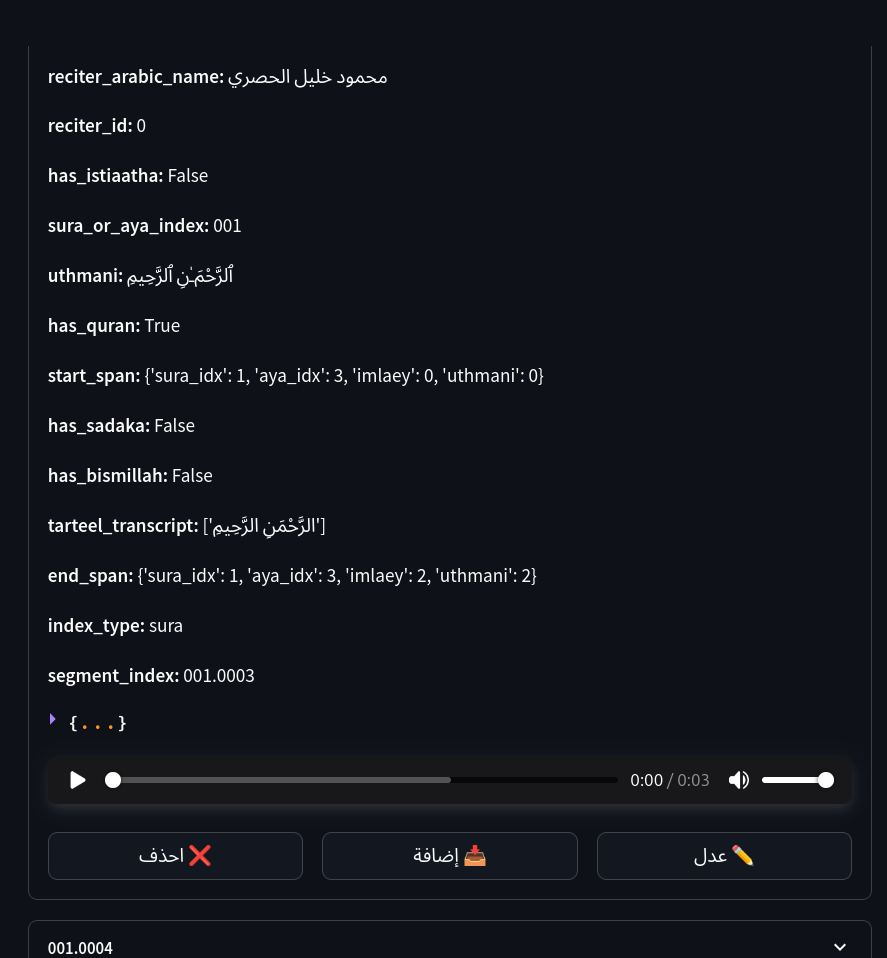

## Verification of Segmentation and Transcription  

### Data Verification

To ensure the highest quality of our dataset, we developed a custom verification interface using [Streamlit](https://streamlit.io/). We manually inspect 50-75 randomly selected samples per Moshaf, focusing on the following aspects:

*   **Segmentation Quality:** Assessing the accuracy of pause detection to determine if adjustments were needed, including:
    *   Increasing or decreasing padding durations
    *   Merging adjacent segments
    *   Splitting undetected segments
*   **Qalqala (القلقلة) Duration Inspection:** Verifying that segments containing Qalqala (قلقة) are fully captured without being truncated by brief silences, ensuring the acoustic feature remains intact.
*   **Hams (همس) Duration Inspection:** Similarly checking segments for Hams (a whispered or airy phonation) to ensure the subtle release of air was not missed by the segmenter.

*Figure 10: The Streamlit-based UI for manually verifying segmentation quality and phonetic feature integrity.*

*Figure 11: The editing view within the verification UI, allowing for manual correction of segment boundaries.*

After completing the annotation process for a Moshaf, the defined correction operations were programmatically applied to the entire dataset to ensure consistency.

**Note:** Moshaf 25.0 was excluded from the final dataset due to irreconcilably poor segmentation quality.

### Transcription Verification: A *Tasmee'*-Inspired Algorithm

To validate the accuracy of the automated speech recognition (ASR) output, we developed a verification algorithm inspired by *Tasmee'* (تسميع)—the traditional practice where a student recites for a teacher to correct mistakes. This statistical algorithm operates under the core assumption that the input recitations are 100% correct, and any errors originate from the ASR model (Tarteel model).

The algorithm proceeds through the following steps:
1.  **Automatic Matching:** Segments are automatically matched to the canonical Quranic text.
2.  **Discrepancy Identification:** The system identifies missing verses, words, or unexpected additions in the transcription.
3.  **Manual Correction:** flagged discrepancies are presented for manual review and correction within our annotation UI, completing the *Tasmee'* feedback loop.

**Algorithm 1: Tasmeea Algorithm**

**Input:**  
- `text_segments = [s₁, s₂, ..., sₙ]`: List of text segments  
- `sura_idx`: Sura index  
- `overlap_words = 6`: Overlap window size  
- `window_words = 30`: Base window size  
- `acceptance_ratio = 0.5`: Minimum acceptance threshold  
- Flags for special phrases (e.g., istiaatha/sadaka)  

**Output:**  
List of tuples `(match, ratio)` per segment  

**Initialize:**  
1. `aya ← 1` ▷ Start at first verse  
2. `penalty ← 0`  

**For each** segment `sᵢ` in `text_segments`:  
3. `norm_text ← normalize(sᵢ)` ▷ Remove spaces/diacritics  
4. `min_win ← window_words - 10`  
5. `max_win ← window_words + 10`  
6. `start_range ← [-(overlap + penalty), (overlap + max(window_words, max_win) + penalty]`  

7. **If** first segment **and** `include_istiaatha` flag set:  
   - Check istiaatha special case  
8. **Else if** last segment **and** `include_sadaka` flag set:  
   - Check sadaka special case  

9. `best_ratio ← 0`  
10. `best_match ← null`  

11. **For each** start position `p` in `start_range`:  
12.     **For each** window size `w` in `[min_win, max_win]`:  
13.         `c ← extract_candidate(aya, p, w)`  
14.         `dist ← edit_distance(norm_text, c)`  
15.         `ratio ← 1 - min(dist, |norm_text|) / |norm_text|`  
16.         **If** `ratio > best_ratio` **or** (`ratio == best_ratio` **and** `|p| < |best_start|`):  
17.             Update `best_ratio`, `best_match`, `best_start`, `best_window`  

18. **If** `best_ratio < acceptance_ratio`:  
19.     Output `(null, best_ratio)`  
20.     `penalty ← max_win`  
21.     `aya ← aya + 1` ▷ Default advance  
22. **Else:**  
23.     Output `(best_match, best_ratio)`  
24.     `aya ← aya + best_start + best_window`  
25.     `penalty ← 0`  

**Complexity:** O(N·W·L²)  
- *N* = number of segments  
- *W* = window size range  
- *L* = segment length  
