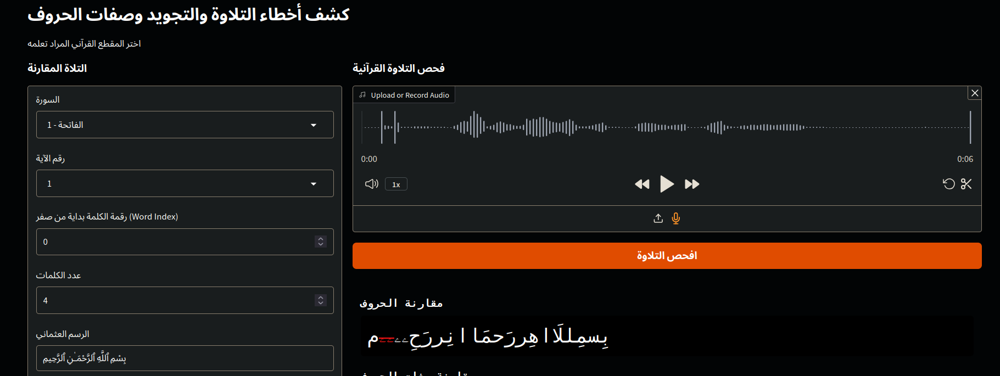

# Results  

We trained on all Mushaf provided above, reserving Mushaf 26.1 and 19.0 for testing. The evaluation results are presented in Table [table_results]. The Average Phoneme Error Rate is 0.16%, which proves our idea that the Quran Phonetics Script can be learned.

We tested some actual samples with errors in Madd, Ghunna, Qalqala, and Tafkheem. The model was able to detect them even though it was not trained on recitations with pronunciation errors. Although this is not sufficient, we plan to annotate available datasets like [khan2021tarteel] to conduct comprehensive evaluations.

We note that the PER across nearly all levels is balanced, except for the phoneme level, as it has a much larger vocabulary of 44 (with padding).
| Metric                          | Value     |
|---------------------------------|-----------|
| loss                      | 0.01162   |
| per_phonemes              | 0.00543   |
| per_hams_or_jahr          | 0.00117   |
| per_shidda_or_rakhawa     | 0.00172   |
| per_tafkheem_or_taqeeq    | 0.00167   |
| per_itbaq                 | 0.00092   |
| per_safeer                | 0.00132   |
| per_qalqla                | 0.00085   |
| per_tikraar               | 0.0009    |
| per_tafashie              | 0.0016    |
| per_istitala              | 0.0008    |
| per_ghonna                | 0.0013    |
| average_per               | 0.0016    |
[table_results]
Test Results on moshaf 26.1 and 19.0. We achieved an Average Phoneme Error Rate (PER) of **0.16%**, demonstrating that our Quran Phonetic Script can be learned efficiently by the model. The phonemer error rate for `phonemes` level is the largest 0.5% because it has the largest vocabulary.

After that we have create a demonstration app to see how our model perform in reallife senario.

The users experient was extremly positive. Althout the model was not trained on feamle samples it was able to detect erros for them.

