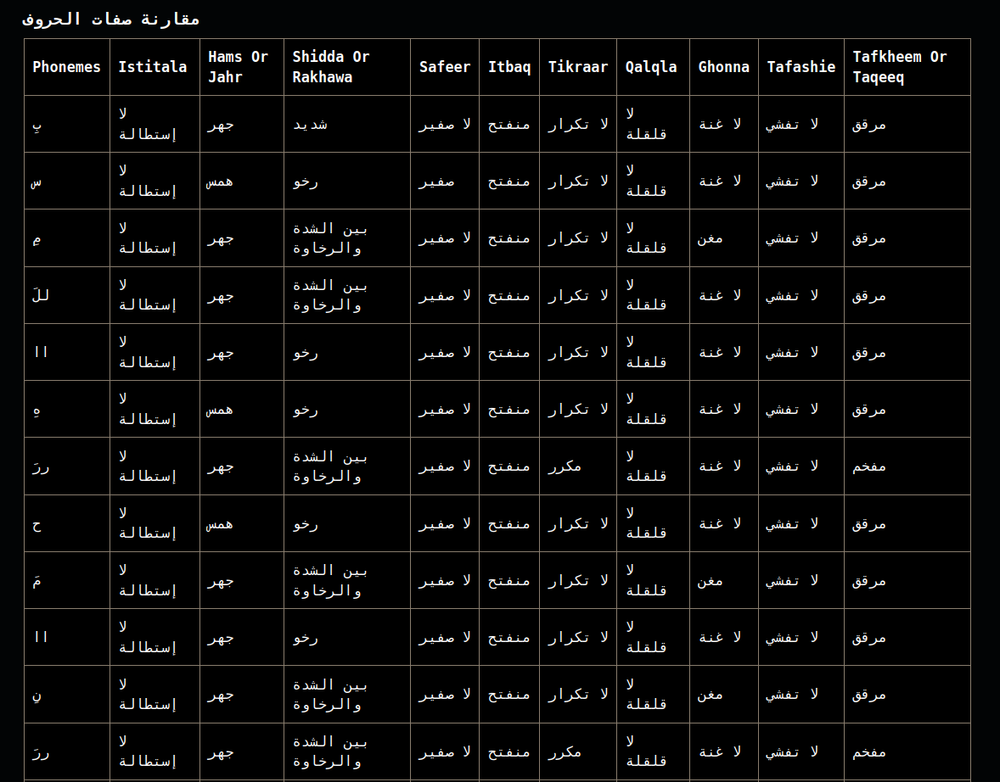

# Results  

We trained our model on all available Mushaf recitations, reserving Mushaf 19.0, 29.0, and 30.0 exclusively for testing. The evaluation results are summarized in Table [table_results]. The achieved Average Phoneme Error Rate (PER) of 0.21% strongly supports our hypothesis that the Quran Phonetic Script is learnable using modern speech processing techniques.

To assess real-world error detection, we evaluated on qdat_bench, which contains authentic learner mistakes annotated across phonemes, 10 sifat levels, and key Tajweed rules. Despite being trained only on error-free expert recitations, the model achieved an average PER of 0.019 (1.9%), an average Tajweed F1 of 0.758, and 0.847 accuracy, demonstrating strong generalization to learner data.

We observe that the PER is well-balanced across nearly all phonetic and attribute levels, with the exception of the phoneme level itself. This is expected, as the phoneme level has a significantly larger vocabulary (44 symbols, including padding), increasing its complexity relative to the attribute levels.

| Metric                      | Value     |
|-----------------------------|-----------|
| loss                        | 0.01196   |
| per_phonemes                | 0.00538   |
| per_hams_or_jahr            | 0.00144   |
| per_shidda_or_rakhawa       | 0.00267   |
| per_tafkheem_or_taqeeq      | 0.00219   |
| per_itbaq                   | 0.00100   |
| per_safeer                  | 0.00146   |
| per_qalqla                  | 0.00094   |
| per_tikraar                 | 0.00427   |
| per_tafashie                | 0.00146   |
| per_istitala                | 0.00087   |
| per_ghonna                  | 0.00128   |
| average_per                 | 0.00209   |

[table_results]
*Test results on Mushaf 19.0, 29.0, and 30.0. The Average Phoneme Error Rate (PER) is **0.21%**, confirming the learnability of the Quran Phonetic Script. The phoneme-level PER is higher (0.538%) due to its larger vocabulary.*

To evaluate real-world performance, we developed a demonstration application using [Gradio](https://www.gradio.app/). The interface allows users to record or upload their recitations and receive immediate phonetic and attribute-level feedback.

User feedback has been extremely positive. Notably, the model generalized well to female voices despite being trained exclusively on male recitations, successfully detecting common errors such as incorrect *Madd* elongation or weak *Qalqalah* pronunciation. This demonstrates the robustness and practical applicability of our approach.
