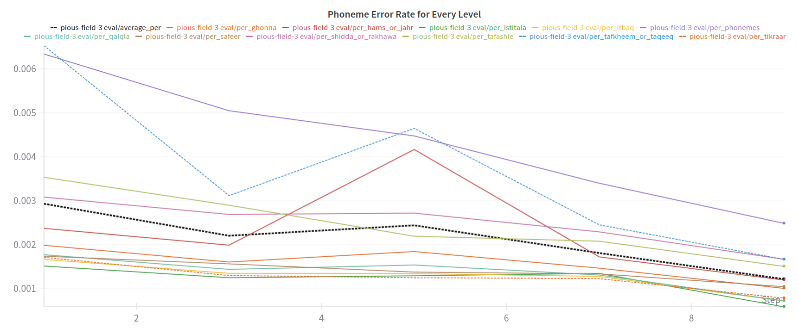

# Ablation Studies

We conducted more than 13 experiments. To tune the weights for every level, we ran an evaluation set for each experiment on 20% of the training data and logged the Phoneme Error Rate (PER) per level. Our goal was to minimize two metrics:
* Average Phoneme Error Rate (PER).
* Standard deviation across all levels.

We report the best three experiments, labeled `EXP1`, `EXP2`, and `EXP3`. We adjusted the loss weight for every level in each experiment. The weight for the `phonemes` level was kept constant across all runs at 0.4, while the weights for `shidda_or_rakhawa` and `tafkheem_or_tarqeeq` were varied to achieve the best possible results.

| Attribute              | EXP1     | EXP2      | EXP3      |
|------------------------|----------|-----------|-----------|
| phonemes               | 0.4      | 0.4       | 0.4       |
| tikraar                | 0.06     | 0.058625  | 0.059625  |
| tafkheem_or_tarqeeq    | 0.06     | 0.063     | 0.0060    |
| tafashie               | 0.06     | 0.05825   | 0.059625  |
| Qalqala                | 0.06     | 0.0585    | 0.059625  |
| Safeer                 | 0.06     | 0.05825   | 0.059625  |
| Shidda_or_rakhawa      | 0.06     | 0.068     | 0.059625  |
| Istitala               | 0.06     | 0.05825   | 0.059625  |
| Itbaaq                 | 0.06     | 0.05825   | 0.059625  |
| Ghonna                 | 0.060    | 0.05825   | 0.059625  |
| hams_or_jahr           | 0.06     | 0.05825   | 0.059625  |
| average_per            | 0.065    | 0.05825   | 0.059625  |
| std_per                | 0.06     | 0.05825   | 0.059625  |
[table_results_v2_weights]
The table above shows different loss weights applied to equation [loss_equation] for three experiments: `EXP1`, `EXP2`, and `EXP3`. The `phonemes` level weight was kept constant across all runs. In each run, we tuned the weights for `shidda_or_rakhawa` and `tafkheem_or_tarqeeq` to minimize the average Phoneme Error Rate (PER) and the standard deviation across all levels. Note that the sum of all loss weights adds to 1.

We observed that `EXP3` yielded the best results, with an average PER of 0.293% and a standard deviation of 0.0017, as shown in both Table [table_results_v2] and Figure [figure_results_v2_std]. `EXP3` performed the best because it allocates more weight to levels that contain more labels—`shidda_or_rakhawa`—and to the more challenging level `tafkheem_or_tarqeeq`, without significantly affecting the rest of the levels.

| Attribute              | EXP1      | EXP2     | EXP3     |
|------------------------|-----------|----------|----------|
| phonemes               | 0.0069    | 0.0069   | 0.0063   |
| tikraar                | 0.006     | 0.006    | 0.0017   |
| tafkheem_or_tarqeeq    | 0.002599  | 0.00279  | 0.0065   |
| tafashie               | 0.001837  | 0.0025   | 0.0035   |
| Qalqala                | 0.001808  | 0.008    | 0.00174  |
| Safeer                 | 0.00346   | 0.00246  | 0.00174  |
| Shidda_or_rakhawa      | 0.015276  | 0.0053   | 0.0031   |
| Istitala               | 0.00243   | 0.00166  | 0.001525 |
| Itbaaq                 | 0.00176   | 0.00217  | 0.00168  |
| Ghonna                 | 0.044     | 0.02675  | 0.00199  |
| hams_or_jahr           | 0.0024    | 0.00256  | 0.00234  |
| average_per            | 0.0080455 | 0.006    | 0.00293  |
| std_per                | 0.0191    | 0.0062   | 0.0017   |
[table_results_v2]
Phoneme Error Rate for each level on 20% of the training data. `EXP3` performs best by assigning higher weight to levels with more labels (`shidda_or_rakhawa`) and the more challenging `tafkheem_or_tarqeeq` level, without significant differences in the remaining levels.

After that we continued the training of `EXP3` thay yields the results in [table_results]

# Model Version 3

After completing our initial training and publishing the model, we identified a minor bug and developed a new feature:

*   **Bug Fix:** The model was incorrectly classifying a *yaa* (ي) with a *shadda* as `yaa_madd` instead of as two separate *yaa* characters.
*   **New Feature:** A third label, `low_mofakham`, was added to the `tafkheem_or_tarqeeq` level.

We trained this Version 3 model using the following loss weights: 0.4 for the `phonemes` level, 0.0605 for both `tafkheem_or_tarqeeq` and `shidda_or_rakhawa`, and 0.05987 for the remaining levels.

For testing, we reserved mosahaf `19.0`, `29.0`, and `30.0` as a held-out test set. The results are shown in Table [table_results_v3].

| Metric                   | Value     |
|--------------------------|-----------|
| per_phonemes             | 0.00538   |
| per_hams_or_jahr         | 0.00144   |
| per_shidda_or_rakhawa    | 0.00267   |
| per_tafkheem_or_taqeeq   | 0.00219   |
| per_itbaq                | 0.00100   |
| per_safeer               | 0.00146   |
| per_qalqla               | 0.00094   |
| per_tikraar              | 0.00427   |
| per_tafashie             | 0.00146   |
| per_istitala             | 0.00087   |
| per_ghonna               | 0.00128   |
| average_per              | 0.00209   |

[table_results_v3]
Testing results on mosahaf `19.0`, `29.0`, and `30.0` showing a balanced Phoneme Error Rate (PER) across all levels. The `phonemes` level has a naturally higher PER (0.538\%) as it is the largest vocabulary (44 tokens: 43 phonemes + 1 padding token).
