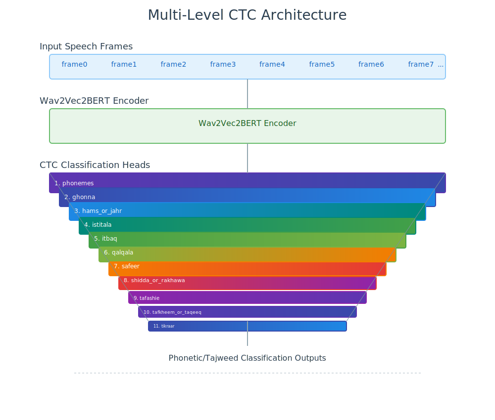
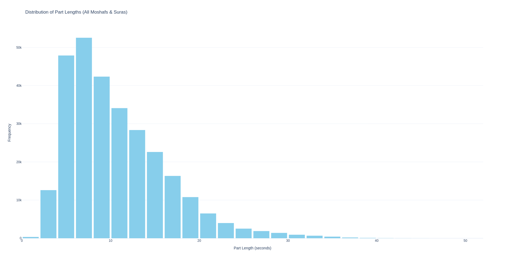

# Modeling

Out Quran Phonetic script has two ouputs: `phonemes` and `sifat` which has 10 attributes. We modeled as: Imagine you are given an input speech utterance and want to ouput the trnascript in Arabicn, English, Frensh and Germain at the same time we modeled this an speech Encoder on top of it a Lineary layer for each Language as simple as that. Replace language by the 11 levels: `ponemes` with the 10 sifta, so weh have 11 parallel transcript levels at the end. We chosed CTC loss [graves2006ctc] with no Language model integration because We want to capture what the user said not what the user indented to say. We name our archicture as Multilivel CTC. we compute the loss by averaging out all CTC loss for the 11 levels and give weight to `phonemes` level (0.4) as it has the more vocablury size (43) than the other levels.

We fine-tuned facebook Wav2Vec2Bert [barrault2023seamless] for a single epcoh with a constant learning rate of `5e-5`. We applied augmentaions same as Silero VAD [Silero VAD] we `audiomentatinos` library [Audiomentations] with addition to: `TimeStretch` and `GainTransition`. We filtered out samples longed than `30 seconds` not because the model can not handel but because of effcient GPU utilization sucrfaisin with only 3k samples out ou 250k training samples 

