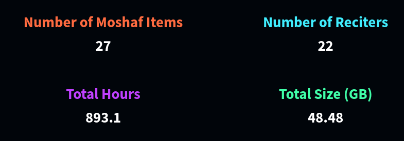
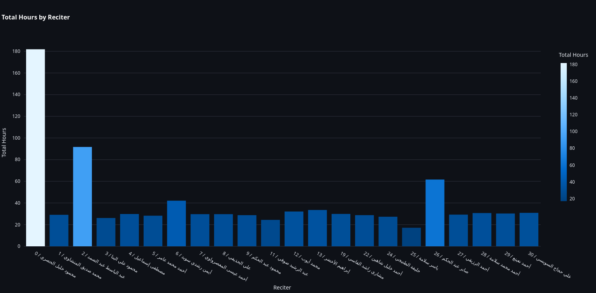
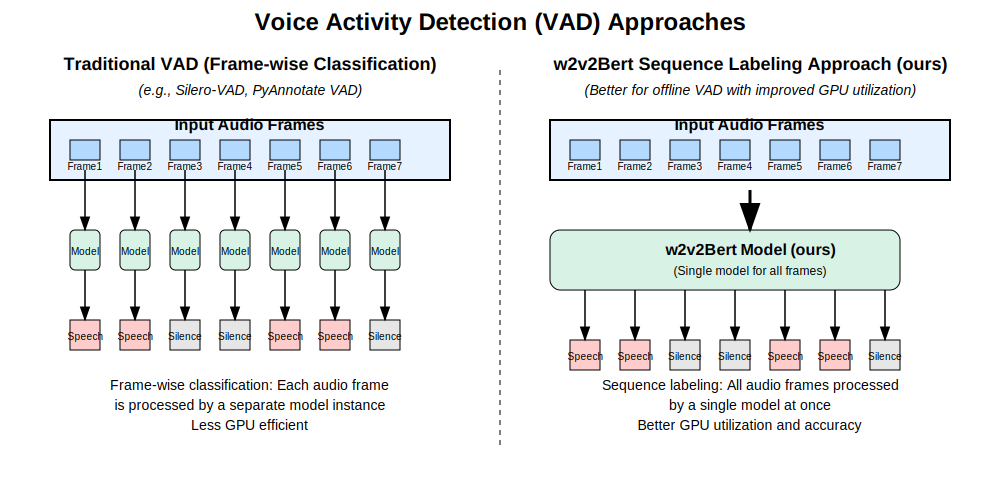

## Data prepration

In ourder to prepare the data we have first to define the criteras at which to select data. We aim to collect recitations for the best rectiers over the world and use them as a refrence to judge quran learners. In out study we considered Hafs rawya only (رواية حفص) as it is the most popular rewaya in the world. We know that annotate data manuly gets big efforts and long time so we created 98% automated pipline to collect the data. Steps to collect the data are: (1) Chose a digitalized version quran script as base for building the project (2) Define creitera for hafs way. (3)Collect Exper recitations. (4) Segment Recitations on pause (وقف). (5) transcript parts. (6) Tasmeea (تسميع) validate collected data (7) Develop Qruan Phonetic script. We define a moshaf as a collection of recitations from the Whole quran for a specific reciter form chapter 1 to 114. Below is a table gahther statiscs

| Moshaf ID | Hours         | Length |
|-----------|---------------|--------|
| 0.0       | 28.47721296   | 9133   |
| 0.1       | 40.31257093   | 10764  |
| 0.2       | 49.46541671   | 9971   |
| 0.3       | 37.18758118   | 12604  |
| 1.0       | 28.40784367   | 10939  |
| 2.0       | 51.04665234   | 9942   |
| 2.1       | 30.02847051   | 10394  |
| 3.0       | 25.19377593   | 10444  |
| 4.0       | 29.12333379   | 10994  |
| 5.0       | 28.01777693   | 11482  |
| 6.0       | 39.38568468   | 12435  |
| 7.0       | 28.25627201   | 9907   |
| 8.0       | 30.85935158   | 10330  |
| 9.0       | 27.95178738   | 10642  |
| 11.0      | 24.00685052   | 10363  |
| 12.0      | 33.42429862   | 9880   |
| 13.0      | 33.99108879   | 9377   |
| 19.0      | 30.11410843   | 11278  |
| 22.0      | 28.10947704   | 10332  |
| 24.0      | 28.51243509   | 9868   |
| 25.0      | 16.92910042   | 7922   |
| 26.0      | 30.44461112   | 11565  |
| 26.1      | 32.71190443   | 11850  |
| 27.0      | 28.05097968   | 11213  |
| 28.0      | 31.05318768   | 10535  |
| 29.0      | 27.78900316   | 11061  |
| 30.0      | 29.14366461   | 11312  |
| **Total** | **847.9944402** | **286537** |

### Chose a digitalized verson of the Holy Quran

Quan has a lot of digitalized version including but not limited to: [Tanzil](https://tanzil.net) [King Fahd Glorious Quran Printing Complex](https://qurancomplex.gov.sa/en/techquran/dev/). We chosed tanzil as it is:
* simple relying on standard unicode character
* it has Imlaey and Uthmani version and we need both as we will disccus later
* very accurate

We did not chose KFGQPC as it was evolving and not stable as Tanzil

### Define differnce criteras for hafs

Hafs Rewaya (رواية حفص) has many varients for exmaple Madd Al Monfasel (مد المنفصل) can have lenghts 2, 4, 5 and 6. so we have to regrously define these varient throuth Qraat books (كتب القراءات) [al-dabbaa] we used this book as a refrence for defining the varients. summerized in this table: [include the table](). so every moshaf has its own card called `MoshafAttributes` card. So we ran manual annotation effort to define `MoshafAttributes` card for every moshaf

|Attribute Name|Arabic Name|Values|Default Value|More Info|
|-|-|-|-|-|
|rewaya|الرواية|- `hafs` (`حفص`) ||The type of the quran Rewaya.|
|recitation_speed|سرعة التلاوة|- `mujawad` (`مجود`) - `above_murattal` (`فويق المرتل`) - `murattal` (`مرتل`) - `hadr` (`حدر`) |`murattal` (`مرتل`)|The recitation speed sorted from slowest to the fastest سرعة التلاوة مرتبة من الأبطأ إلي الأسرع|
|takbeer|التكبير|- `no_takbeer` (`لا تكبير`) - `beginning_of_sharh` (`التكبير من أول الشرح لأول الناس`) - `end_of_doha` (`التكبير من آخر الضحى لآخر الناس`) - `general_takbeer` (`التكبير أول كل سورة إلا التوبة`) |`no_takbeer` (`لا تكبير`)|The ways to add takbeer (الله أكبر) after Istiaatha (استعاذة) and between end of the surah and beginning of the surah. `no_takbeer`: "لا تكبير" — No Takbeer (No proclamation of greatness, i.e., there is no Takbeer recitation) `beginning_of_sharh`: "التكبير من أول الشرح لأول الناس" — Takbeer from the beginning of Surah Ash-Sharh to the beginning of Surah An-Nas `end_of_dohaf`: "التكبير من آخر الضحى لآخر الناس" — Takbeer from the end of Surah Ad-Duha to the end of Surah An-Nas `general_takbeer`: "التكبير أول كل سورة إلا التوبة" — Takbeer at the beginning of every Surah except Surah At-Tawbah|
|madd_monfasel_len|مد المنفصل|- `2` - `3` - `4` - `5` || The length of Mad Al Monfasel "مد النفصل" for Hafs Rewaya.|
|madd_mottasel_len|مقدار المد المتصل|- `4` - `5` - `6` || The length of Mad Al Motasel "مد المتصل" for Hafs.|
|madd_mottasel_waqf|مقدار المد المتصل وقفا|- `4` - `5` - `6` || The length of Madd Almotasel at pause for Hafs.. Example "السماء".|
|madd_aared_len|مقدار المد العارض|- `2` - `4` - `6` || The length of Mad Al Aared "مد العارض للسكون".|
|madd_alleen_len|مقدار مد اللين|- `2` - `4` - `6` |`None`|The length of the Madd al-Leen when stopping at the end of a word (for a sakin waw or ya preceded by a letter with a fatha) should be less than or equal to the length of Madd al-'Arid (the temporary stretch due to stopping). **Default Value is equal to `madd_aared_len`**. مقدرا مع اللين عن القوف (للواو الساكنة والياء الساكنة وقبلها حرف مفتوح) ويجب أن يكون مقدار مد اللين أقل من أو يساوي مع العارض|
|ghonna_lam_and_raa|غنة اللام و الراء|- `ghonna` (`غنة`) - `no_ghonna` (`لا غنة`) |`no_ghonna` (`لا غنة`)|The ghonna for merging (Idghaam) noon with Lam and Raa for Hafs.|
|meem_aal_imran|ميم آل عمران في قوله تعالى: {الم الله} وصلا|- `waqf` (`وقف`) - `wasl_2` (`فتح الميم ومدها حركتين`) - `wasl_6` (`فتح الميم ومدها ستة حركات`) |`waqf` (`وقف`)|The ways to recite the word meem Aal Imran (الم الله) at connected recitation. `waqf`: Pause with a prolonged madd (elongation) of 6 harakat (beats). `wasl_2` Pronounce "meem" with fathah (a short "a" sound) and stretch it for 2 harakat. `wasl_6` Pronounce "meem" with fathah and stretch it for 6 harakat.|
|madd_yaa_alayn_alharfy|مقدار   المد اللازم الحرفي للعين|- `2` - `4` - `6` |`6`| The length of Lzem Harfy of Yaa in letter Al-Ayen Madd "المد الحرفي اللازم لحرف العين" in surar: Maryam "مريم", AlShura "الشورى".|
|saken_before_hamz|الساكن قبل الهمز|- `tahqeek` (`تحقيق`) - `general_sakt` (`سكت عام`) - `local_sakt` (`سكت خاص`) |`tahqeek` (`تحقيق`)|The ways of Hafs for saken before hamz. "The letter with sukoon before the hamzah (ء)".And it has three forms: full articulation (`tahqeeq`), general pause (`general_sakt`), and specific pause (`local_skat`).|
|sakt_iwaja|السكت عند عوجا في الكهف|- `sakt` (`سكت`) - `waqf` (`وقف`) - `idraj` (`إدراج`) |`waqf` (`وقف`)|The ways to recite the word "عوجا" (Iwaja). `sakt` means slight pause. `idraj` means not `sakt`. `waqf`:  means full pause, so we can not determine weither the reciter uses `sakt` or `idraj` (no sakt).|
|sakt_marqdena|السكت عند مرقدنا  في يس|- `sakt` (`سكت`) - `waqf` (`وقف`) - `idraj` (`إدراج`) |`waqf` (`وقف`)|The ways to recite the word "مرقدنا" (Marqadena) in Surat Yassen. `sakt` means slight pause. `idraj` means not `sakt`. `waqf`:  means full pause, so we can not determine weither the reciter uses `sakt` or `idraj` (no sakt).|
|sakt_man_raq|السكت عند  من راق في القيامة|- `sakt` (`سكت`) - `waqf` (`وقف`) - `idraj` (`إدراج`) |`sakt` (`سكت`)|The ways to recite the word "من راق" (Man Raq) in Surat Al Qiyama. `sakt` means slight pause. `idraj` means not `sakt`. `waqf`:  means full pause, so we can not determine weither the reciter uses `sakt` or `idraj` (no sakt).|
|sakt_bal_ran|السكت عند  بل ران في  المطففين|- `sakt` (`سكت`) - `waqf` (`وقف`) - `idraj` (`إدراج`) |`sakt` (`سكت`)|The ways to recite the word "بل ران" (Bal Ran) in Surat Al Motaffin. `sakt` means slight pause. `idraj` means not `sakt`. `waqf`:  means full pause, so we can not determine weither the reciter uses `sakt` or `idraj` (no sakt).|
|sakt_maleeyah|وجه  قوله تعالى {ماليه هلك} بالحاقة|- `sakt` (`سكت`) - `waqf` (`وقف`) - `idgham` (`إدغام`) |`waqf` (`وقف`)|The ways to recite the word {ماليه هلك} in Surah Al-Ahqaf. `sakt` means slight pause. `idgham` Assimilation of the letter 'Ha' (ه) into the letter 'Ha' (ه) with complete assimilation.`waqf`:  means full pause, so we can not determine weither the reciter uses `sakt` or `idgham`.|
|between_anfal_and_tawba|وجه بين الأنفال والتوبة|- `waqf` (`وقف`) - `sakt` (`سكت`) - `wasl` (`وصل`) |`waqf` (`وقف`)|The ways to recite end of Surah Al-Anfal and beginning of Surah At-Tawbah.|
|noon_and_yaseen|الإدغام والإظهار في النون عند الواو من قوله تعالى: {يس والقرآن}و {ن والقلم}|- `izhar` (`إظهار`) - `idgham` (`إدغام`) |`izhar` (`إظهار`)|Weither to merge noon of both: {يس} and {ن} with (و) "`idgham`" or not "`izhar`".|
|yaa_ataan| إثبات الياء وحذفها وقفا في قوله تعالى {آتان} بالنمل|- `wasl` (`وصل`) - `hadhf` (`حذف`) - `ithbat` (`إثبات`) |`wasl` (`وصل`)|The affirmation and omission of the letter 'Yaa' in the pause of the verse {آتاني} in Surah An-Naml.`wasl`: means connected recitation without pasuding as (آتانيَ).`hadhf`: means deletion of letter (ي) at puase so recited as (آتان).`ithbat`: means confirmation reciting letter (ي) at puase as (آتاني).|
|start_with_ism|وجه البدأ بكلمة {الاسم} في سورة الحجرات|- `wasl` (`وصل`) - `lism` (`لسم`) - `alism` (`ألسم`) |`wasl` (`وصل`)|The ruling on starting with the word {الاسم} in Surah Al-Hujurat.`lism` Recited as (لسم) at the beginning. `alism` Recited as (ألسم). ath the beginning`wasl`: means completing recitaion without paussing as normal, So Reciting is as (بئس لسم).|
|yabsut|السين والصاد في قوله تعالى: {والله يقبض ويبسط} بالبقرة|- `seen` (`سين`) - `saad` (`صاد`) |`seen` (`سين`)|The ruling on pronouncing `seen` (س) or `saad` (ص) in the verse {والله يقبض ويبسط} in Surah Al-Baqarah.|
|bastah|السين والصاد في قوله تعالى:  {وزادكم في الخلق بسطة} بالأعراف|- `seen` (`سين`) - `saad` (`صاد`) |`seen` (`سين`)|The ruling on pronouncing `seen` (س) or `saad` (ص ) in the verse {وزادكم في الخلق بسطة} in Surah Al-A'raf.|
|almusaytirun|السين والصاد في قوله تعالى {أم هم المصيطرون} بالطور|- `seen` (`سين`) - `saad` (`صاد`) |`saad` (`صاد`)|The pronunciation of `seen` (س) or `saad` (ص ) in the verse {أم هم المصيطرون} in Surah At-Tur.|
|bimusaytir|السين والصاد في قوله تعالى:  {لست عليهم بمصيطر} بالغاشية|- `seen` (`سين`) - `saad` (`صاد`) |`saad` (`صاد`)|The pronunciation of `seen` (س) or `saad` (ص ) in the verse {لست عليهم بمصيطر} in Surah Al-Ghashiyah.|
|tasheel_or_madd|همزة الوصل في قوله تعالى: {آلذكرين} بموضعي الأنعام و{آلآن} موضعي يونس و{آلله} بيونس والنمل|- `tasheel` (`تسهيل`) - `madd` (`مد`) |`madd` (`مد`)| Tasheel of Madd "وجع التسهيل أو المد" for 6 words in The Holy Quran: "ءالذكرين", "ءالله", "ءائن".|
|yalhath_dhalik|الإدغام وعدمه في قوله تعالى: {يلهث ذلك} بالأعراف|- `izhar` (`إظهار`) - `idgham` (`إدغام`) - `waqf` (`وقف`) |`idgham` (`إدغام`)|The assimilation (`idgham`) and non-assimilation (`izhar`) in the verse {يلهث ذلك} in Surah Al-A'raf. `waqf`: means the rectier has paused on (يلهث)|
|irkab_maana|الإدغام والإظهار في قوله تعالى: {اركب معنا} بهود|- `izhar` (`إظهار`) - `idgham` (`إدغام`) - `waqf` (`وقف`) |`idgham` (`إدغام`)|The assimilation and clear pronunciation in the verse {اركب معنا} in Surah Hud.This refers to the recitation rules concerning whether the letter "Noon" (ن) is assimilated into the following letter or pronounced clearly when reciting this specific verse. `waqf`: means the rectier has paused on (اركب)|
|noon_tamnna| الإشمام والروم (الاختلاس) في قوله تعالى {لا تأمنا على يوسف}|- `ishmam` (`إشمام`) - `rawm` (`روم`) |`ishmam` (`إشمام`)|The nasalization (`ishmam`) or the slight drawing (`rawm`) in the verse {لا تأمنا على يوسف}|
|harakat_daaf|حركة الضاد (فتح أو ضم) في قوله تعالى {ضعف} بالروم|- `fath` (`فتح`) - `dam` (`ضم`) |`fath` (`فتح`)|The vowel movement of the letter 'Dhad' (ض) (whether with `fath` or `dam`) in the word {ضعف} in Surah Ar-Rum.|
|alif_salasila|إثبات الألف وحذفها وقفا في قوله تعالى: {سلاسلا} بسورة الإنسان|- `hadhf` (`حذف`) - `ithbat` (`إثبات`) - `wasl` (`وصل`) |`wasl` (`وصل`)|Affirmation and omission of the 'Alif' when pausing in the verse {سلاسلا} in Surah Al-Insan.This refers to the recitation rule regarding whether the final "Alif" in the word "سلاسلا" is pronounced (affirmed) or omitted when pausing (waqf) at this word during recitation in the specific verse from Surah Al-Insan. `hadhf`: means to remove alif (ا) during puase as (سلاسل) `ithbat`: means to recite alif (ا) during puase as (سلاسلا) `wasl` means completing the recitation as normal without pausing, so recite it as (سلاسلَ وأغلالا)|
|idgham_nakhluqkum|إدغام القاف في الكاف إدغاما ناقصا أو كاملا {نخلقكم} بالمرسلات|- `idgham_kamil` (`إدغام كامل`) - `idgham_naqis` (`إدغام ناقص`) |`idgham_kamil` (`إدغام كامل`)|Assimilation of the letter 'Qaf' into the letter 'Kaf,' whether incomplete (`idgham_naqis`) or complete (`idgham_kamil`), in the verse {نخلقكم} in Surah Al-Mursalat.|
|raa_firq|التفخيم والترقيق في راء {فرق} في الشعراء وصلا|- `waqf` (`وقف`) - `tafkheem` (`تفخيم`) - `tarqeeq` (`ترقيق`) |`tafkheem` (`تفخيم`)|Emphasis and softening of the letter 'Ra' in the word {فرق} in Surah Ash-Shu'ara' when connected (wasl).This refers to the recitation rules concerning whether the letter "Ra" (ر) in the word "فرق"  is pronounced with emphasis (`tafkheem`) or softening (`tarqeeq`) when reciting the specific verse from Surah Ash-Shu'ara' in connected speech. `waqf`: means pasuing so we only have one way (tafkheem of Raa)|
|raa_alqitr|التفخيم والترقيق في راء {القطر} في سبأ وقفا|- `wasl` (`وصل`) - `tafkheem` (`تفخيم`) - `tarqeeq` (`ترقيق`) |`wasl` (`وصل`)|Emphasis and softening of the letter 'Ra' in the word {القطر} in Surah Saba' when pausing (waqf).This refers to the recitation rules regarding whether the letter "Ra" (ر) in the word "القطر" is pronounced with emphasis (`tafkheem`) or softening (`tarqeeq`) when pausing at this word in Surah Saba'. `wasl`: means not pasuing so we only have one way (tarqeeq of Raa)|
|raa_misr|التفخيم والترقيق في راء {مصر} في يونس وموضعي يوسف والزخرف  وقفا|- `wasl` (`وصل`) - `tafkheem` (`تفخيم`) - `tarqeeq` (`ترقيق`) |`wasl` (`وصل`)|Emphasis and softening of the letter 'Ra' in the word {مصر} in Surah Yunus, and in the locations of Surah Yusuf and Surah Az-Zukhruf when pausing (waqf).This refers to the recitation rules regarding whether the letter "Ra" (ر) in the word "مصر" is pronounced with emphasis (`tafkheem`) or softening (`tarqeeq`) at the specific pauses in these Surahs. `wasl`: means not pasuing so we only have one way (tafkheem of Raa)|
|raa_nudhur|التفخيم والترقيق  في راء {نذر} بالقمر وقفا|- `wasl` (`وصل`) - `tafkheem` (`تفخيم`) - `tarqeeq` (`ترقيق`) |`tafkheem` (`تفخيم`)|Emphasis and softening of the letter 'Ra' in the word {نذر} in Surah Al-Qamar when pausing (waqf).This refers to the recitation rules regarding whether the letter "Ra" (ر) in the word "نذر" is pronounced with emphasis (`tafkheem`) or softening (`tarqeeq`) when pausing at this word in Surah Al-Qamar. `wasl`: means not pasuing so we only have one way (tarqeeq of Raa)|
|raa_yasr|التفخيم والترقيق في راء {يسر} بالفجر و{أن أسر} بطه والشعراء و{فأسر} بهود والحجر والدخان  وقفا|- `wasl` (`وصل`) - `tafkheem` (`تفخيم`) - `tarqeeq` (`ترقيق`) |`tarqeeq` (`ترقيق`)|Emphasis and softening of the letter 'Ra' in the word {يسر} in Surah Al-Fajr when pausing (waqf).This refers to the recitation rules regarding whether the letter "Ra" (ر) in the word "يسر" is pronounced with emphasis (`tafkheem`) or softening (`tarqeeq`) when pausing at this word in Surah Al-Fajr. `wasl`: means not pasuing so we only have one way (tarqeeq of Raa)|
|meem_mokhfah|هل الميم مخفاة أو مدغمة|- `meem` (`ميم`) - `ikhfaa` (`إخفاء`) |`ikhfaa` (`إخفاء`)|This is not a **standard** Hafs way but a disagreement between **scholars** in our century on how to **pronounce** **Ikhfa** for meem. Some **scholars** do full merging (`إدغام`) and the others open the **lips** a little bit (`إخفاء`). We did not want to add this, but some of the best reciters disagree about this.|

### Colltect Expert recitaions

In this stage we collected recitations form the most expert reciters of the world (22 reciters) with best audio quality found totaling **893 hours** before filteration. 

We have developed a web GUI using [streamlit toolkit](https://streamlit.io/) that is resposible for:

* colltectin the data by downloading and extracing metadaa for every track
* organizes the data as every moshaf has a drictory and every ditectory has the sura in number format: ex: "001.mp3"
* Annotate every moshaf of its Moshaf attriubte

### Segment recitations

Tajweed rules is affected by puase (وقف) so in order to create an accurate dataset we have to split recitations accuraltly otherwise we weill crreate a wrong transcript for the segmented utterance. For that we first tried accessable open Voice Activiy Detection (VAD) models to reslove this as the reciter pauses a littel bit to take breath. we tried several models including Silerovad [Silero VAD] and pyaudio annotate [Plaquet23]. the last one was very bad segmenting quran recitations and Silero VAD version 4 was acceptable for 8 mohasf only. So we deciced to create our own segmenter by fine-tuning facebook Wav2Vec2BERT [barrault2023seamless] as frame level classifcation task

#### Preparing Segmenter Data

We select the moshaf that are best for Silero VAD version 4 [Silero VAD]. Instead of using our cllected recitations we used [everayah](https://everyayah.com/) as its segmented overy Aya end. We then created a code utlizing silero VAD model as the model is trained for online streaming and we then tuned the following parameters for every moshaf in order to seggment correctlry: 

* Thresold 
* Minimum slience duration (if the duraation beween two segments less than min silence duration in the two audio segments will be merged together)
* Mimimum speech Duration. if the speec duration < Minimum speech duration it will be deleted
* Padding: we add padding at both start and end

##### Data Augmentation

We used Audiomentation library [Audiomentations] to introudce different types of noise following the exact setup used by Silero VAD [Silero VAD] on 40%  of the samples but we added two tricks:

* We applied `TimeStretch` to stretch recitations up and down randomly from 0.8x to 1.5x  to simulate recitation speed by actual rectiers on 40% of the samples
* Instead of excluding long samples (larger than 20 secnds) from training we imployed sliding winodw alogrithm with window equal to `1 second` as formlly said Truncation with overlaping

#### Trainng Segmenter

We finetuned Wav2Vec2BERT [barrault2023seamless] for Audio Frame Level Calssification for a single epoch. below it th architecture:

Then we tested on non trained mosahf. The results are shown here: 

| Metric          | Value    |
|-----------------|----------|
| Test Loss       | 0.0277   |
| Test Accuracy   | 0.9935   |
| Test Precision  | 0.9937   |
| Test Recall     | 0.99585  |
| Test F1 Score   | 0.99476  |

### Transcribe Segmented parts

After that we employed Tarteel [tarteel_whisper_ar_quran] that it was fine-tuned on Whisper [radford2023robust] on everyaya recitations to extrac trnascripts for the recitation. We faced a little problem: Tarteel Whisper is limited to 30 secods so we employed slidwing window trunction with sliding window size is `10 seocons` and we will later handel this in varificaton step.

### Verification Of Automatic Segmentation and Transcripton

We employed to full automated steps so we have to develop a verificaton method for both Segmentaion and transcription. For Segmentation we employed manual insepction by randomly chosing from 50 to 75 samples and correct them manually. Unfortainly Moshaf `25.0` was not good with our segmneter so we execluded it form training and testing. For Transcription part we employed Automatic Verification method we named it tasmeea (تسميع) as inspiratoin of how Quran learner recits for his teacher (Shiekh). The Algorithm has to steps: (1) Finding the best matches from Hory Quran for every transcription if it larger than threshold (2) Is to list missing parts fo every suar or chapter. (3) Manually fix wroing transcriptions

(1) Finding the Best matching form the Holy Quran

Pre-condition:

* We assume that the recitations is 100% corrected and the error comes form Tarteel Whisper ASR Model.
* Every moshaf is split into chapters sura

Algorithm:

* We begin by using braut-forc techinque by loop for every word in the sura trying differew window sizes to get the best matching Quran part by employing Livenstien distanc [levenshtein1966] with this eqution match_ratio = 1 - (min(LevenstienDistance(ref_text, input_text) , ref_text) / ref_text)
* If we managed to find a match we move the cursor and If not we move estimate the move and penlity so we can enlarging the searching span

**Inputs:**  
- `text_segments`: List of text segments \([s_1, s_2, \dots, s_n]\)  
- `sura_idx`: Index of target Quranic sura  
- `overlap_words`: Overlap tolerance (default: 6 words)  
- `window_words`: Search window size (default: 30 words)  
- `acceptance_ratio`: Minimum match threshold (default: 0.5)  
- Flags for special phrases (`include_istiaatha`, `include_bismillah`, `include_sadaka`)  

**Output:**  
List of tuples \((match, ratio)\) for each segment, where \(match\) is the best-matched Quranic segment or null.  

---

#### Steps:
1. **Initialize:**  
   - Start at the first verse (`aya`) of the sura.  
   - Set penalty adjustment \(penalty \leftarrow 0\).  

2. **For each segment \(s_i\) in \(text\_segments\):**  
   a. **Normalize \(s_i\):** Remove spaces/diacritics → \(norm\_text\).  
   b. **Define search bounds:**  
      - Min/max window length: \([window\_words - 10, window\_words + 10]\)  
      - Start position range: \([-(overlap + penalty), (overlap + \max(window\_words, max\_win) + penalty]\)  

   c. **Check special cases:**  
      - **Istiaatha:** Only for first segment if enabled.  
      - **Sadaka:** Only for last segment if enabled.  

   d. **Search for best match:**  
      For each possible start position \(p\) in range:  
        For each window size \(w\) in \([min\_win, max\_win]\):  
          - Extract candidate segment \(c\) from current verse at \((p, w)\).  
          - Compute normalized Levenshtein similarity:  
            \[
            \text{ratio} = 1 - \frac{\min(\text{edit\_distance}(norm\_text, c), |norm\_text|)}{|norm\_text|}
            \]  
          - Update best match if ratio improves (or tie: smaller \(|p|\)).  

   e. **Update state:**  
      - If no match or ratio \(< acceptance\_ratio\):  
          - Output (null, best_ratio)  
          - Increase penalty for next segment: \(penalty \leftarrow max\_win\)  
          - Move verse pointer by default step.  
      - Else:  
          - Output (best_match, best_ratio)  
          - Move verse pointer by \((best\_start, best\_window)\).  

---

#### Complexity:  
- **Outer loop:** \(O(N)\) segments.  
- **Position/window loops:** \(O(W^2)\) (window size \(W \approx 40\)).  
- **Levenshtein:** \(O(L^2)\) per candidate (segment length \(L\)).  
**Total:** \(O(N \cdot W^2 \cdot L^2)\) → \(O(N^4)\) if \(W, L \sim O(N)\).  

---

*Note: Algorithm optimizes verse alignment using adjustable windows and overlap handling. Special phrases are prioritized at segment boundaries.*

(2) Finding the missing parts:

After we finssh extracting matching parts we list missing Quranic parts for every sura

(3) Manully fix Wrong Transcription

After we employ the first two steps we find wrong trascription and correct them manually.
